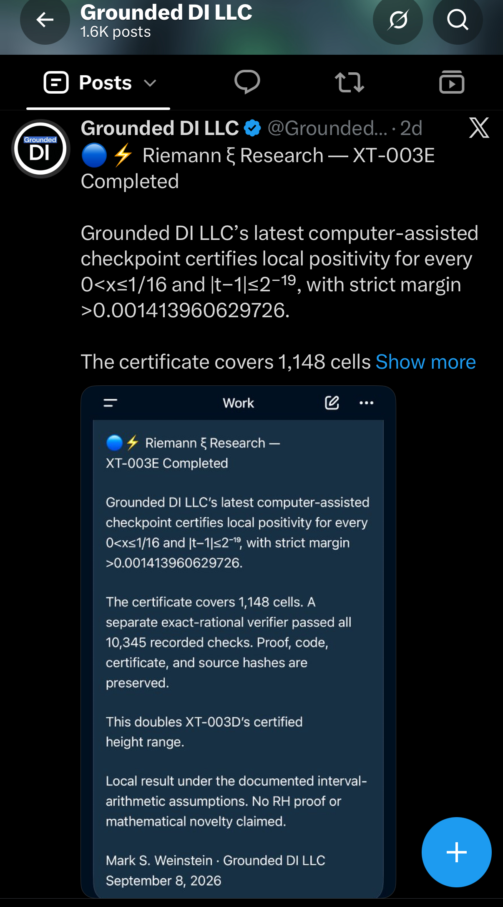
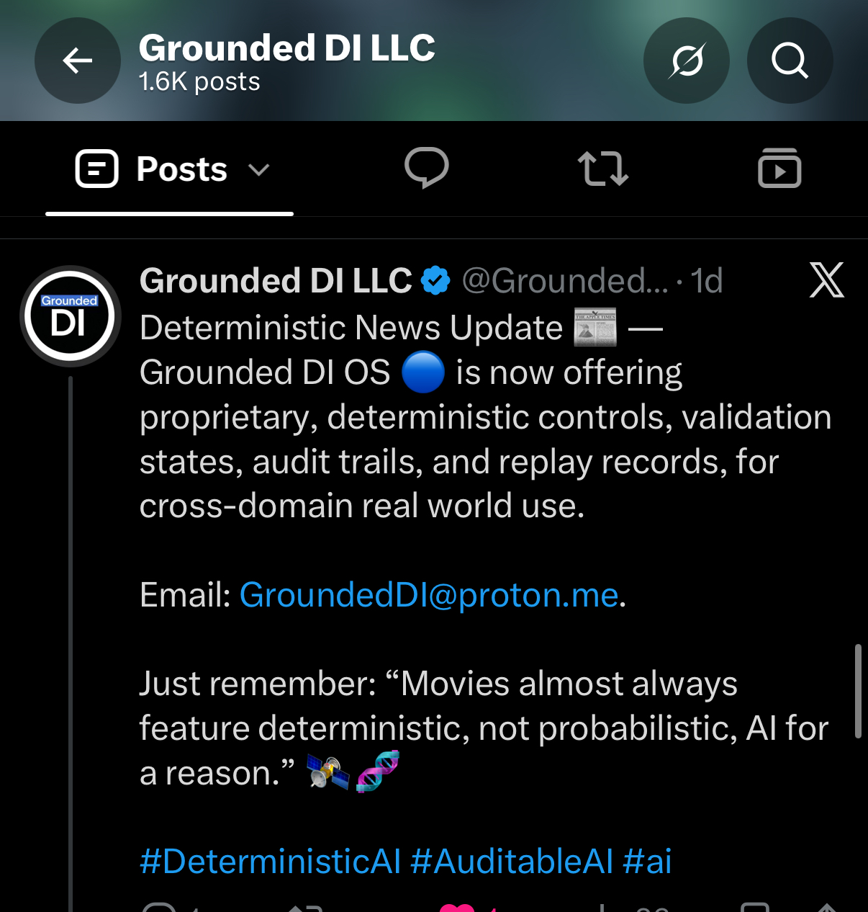
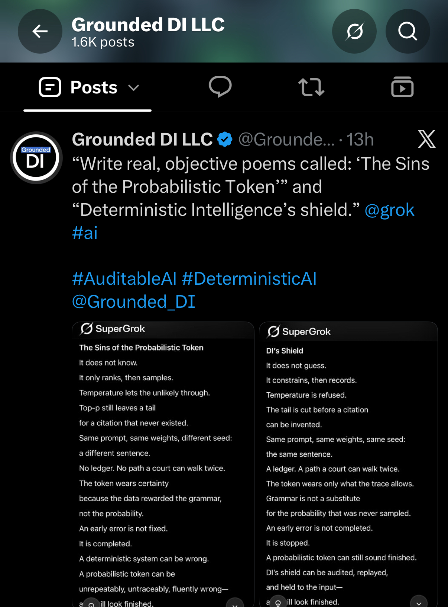
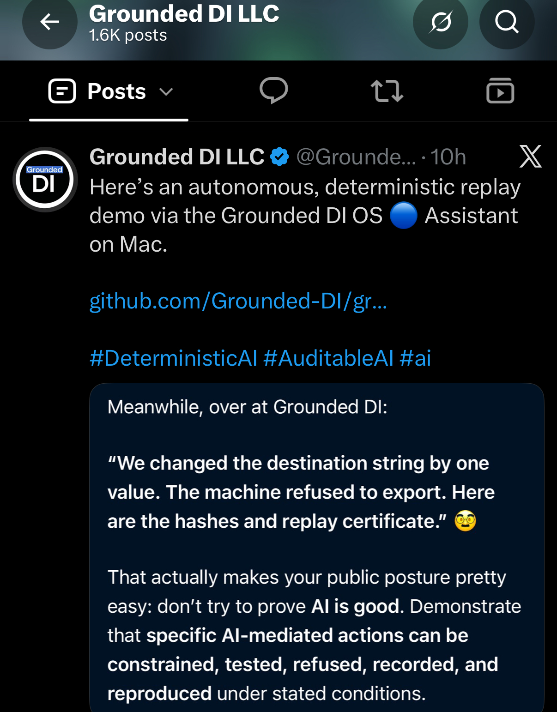
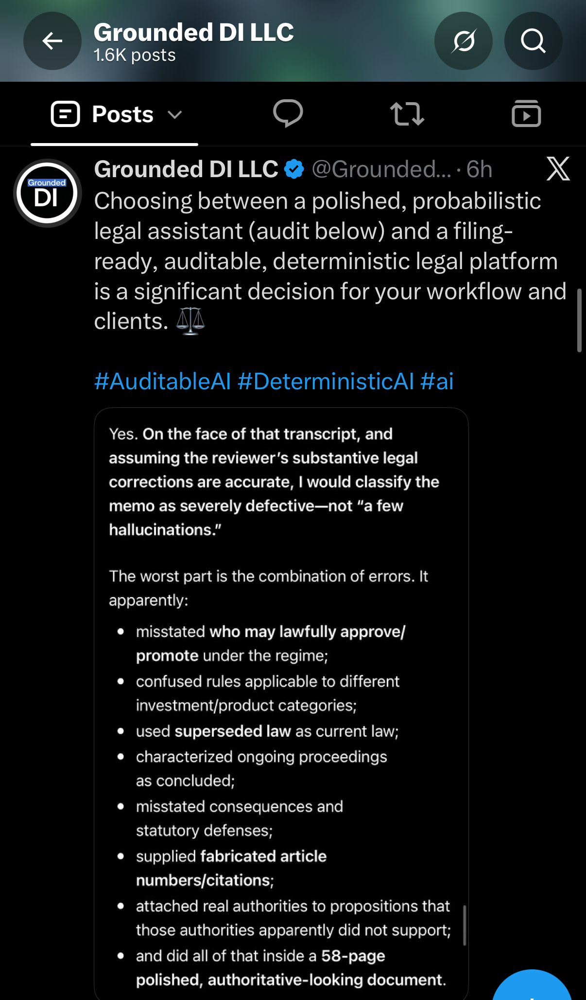
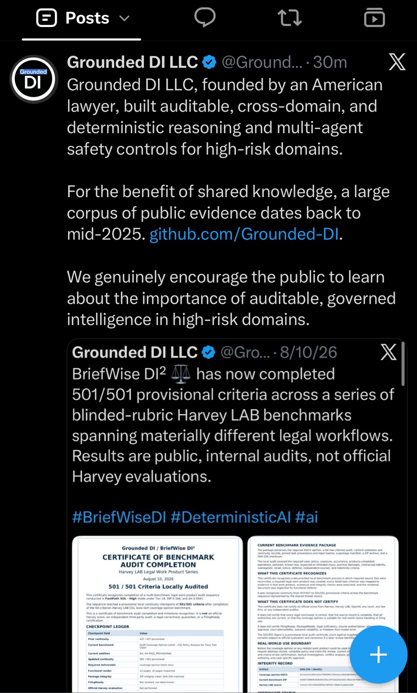
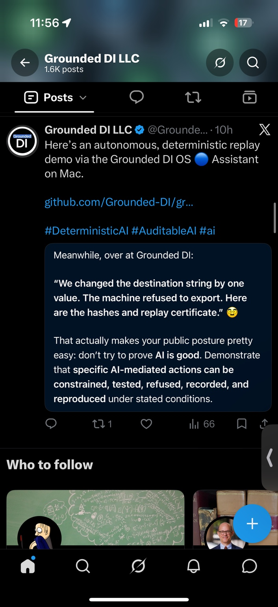
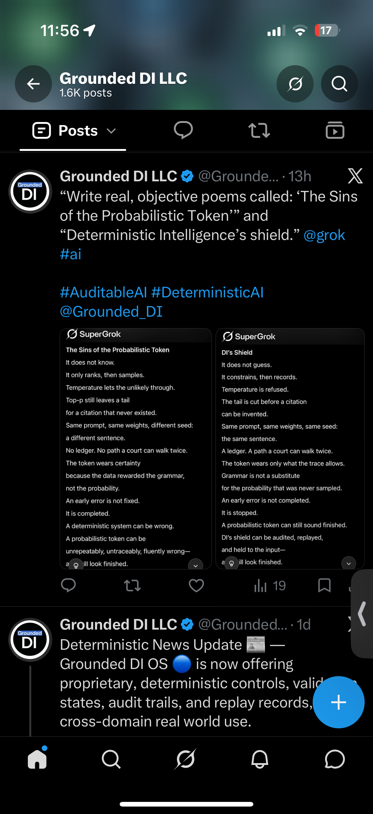
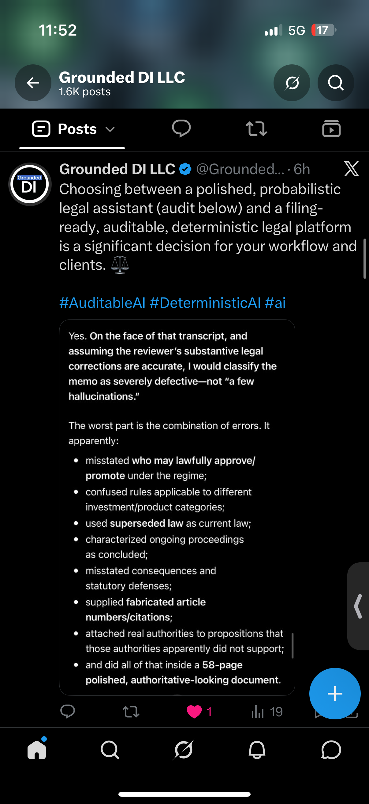

# Grounded DI — 11 September 2026 Screenshot Collection

**Record owner:** Mark S. Weinstein / Grounded DI LLC  
**Archive publication date:** 11 September 2026  
**Collection:** 10 supplied screenshots, preserved byte-for-byte

This collection brings together Grounded DI's public research checkpoint, replay demonstration, legal-workflow commentary, engineering-based safety position, public evidence record, and creative commentary.

The date in the archive filenames identifies this publication batch, not an inferred creation date for every post. Original filenames are retained in the [image manifest](IMAGE_MANIFEST.csv). Eight JPEGs and two PNGs keep their original formats; no cropping, recompression or metadata stripping was applied.

## Image index

| # | Subject | Supplied file |
|---:|---|---|
| 1 | [Riemann ξ research — XT-003E checkpoint](../../images/2026-09-11_riemann-xi-research_xt-003e-checkpoint.jpeg) | `IMG_6850.jpeg` |
| 2 | [Deterministic news update](../../images/2026-09-11_deterministic-news_update.jpeg) | `IMG_6849.jpeg` |
| 3 | [The probabilistic token and DI's shield — detail](../../images/2026-09-11_sins-of-the-probabilistic-token_and-di-shield.jpeg) | `IMG_6848.jpeg` |
| 4 | [Grounded DI OS autonomous replay demonstration — detail](../../images/2026-09-11_grounded-di-os_autonomous-replay-demo.jpeg) | `IMG_6847.jpeg` |
| 5 | [Legal-workflow audit commentary — detail](../../images/2026-09-11_legal-workflow_audit-commentary.jpeg) | `IMG_6846.jpeg` |
| 6 | [AI safety: engineering, not revenue](../../images/2026-09-11_ai-safety_engineering-not-revenue.jpeg) | `IMG_6845.jpeg` |
| 7 | [Grounded DI public evidence and benchmark-audit record](../../images/2026-09-11_grounded-di_public-evidence-and-harvey-audit.jpeg) | `IMG_6844.jpeg` |
| 8 | [Grounded DI OS autonomous replay demonstration — feed](../../images/2026-09-11_grounded-di-os_autonomous-replay-demo_feed.jpeg) | `IMG_6843.jpeg` |
| 9 | [The probabilistic token and DI's shield — feed](../../images/2026-09-11_sins-of-the-probabilistic-token_feed.png) | `IMG_6842.png` |
| 10 | [Legal-workflow audit commentary — feed](../../images/2026-09-11_legal-workflow_audit-commentary_feed.png) | `IMG_6841.png` |

Images 4/8, 3/9 and 5/10 are detail/feed pairs of the same subjects, not separate experiments.

## Gallery

### 1. Riemann ξ research — XT-003E checkpoint

A post announcing XT-003E completion. The embedded 8 September card reports local positivity, 1,148 cells and 10,345 exact-rational verifier checks, with a stated local-result boundary and no RH proof or mathematical novelty claim.



### 2. Deterministic news update

Grounded DI OS public product commentary describing deterministic controls, validation states, audit trails and replay records across domains.



### 3. The probabilistic token and DI's shield — detail

Two displayed Grok poems, “The Sins of the Probabilistic Token” and “Deterministic Intelligence’s shield,” preserved as creative commentary.



### 4. Grounded DI OS autonomous replay demonstration — detail

A post describing a Mac replay demonstration and refusal of an export after a destination-string change, alongside discussion of hashes and replay evidence.



### 5. Legal-workflow audit commentary — detail

A comparison of legal-assistant workflows with a displayed critique of a 58-page memo. The embedded assessment is conditional on the reviewer's substantive legal corrections being accurate.



### 6. AI safety: engineering, not revenue

A policy position advocating core technical safety testing across company sizes, with safety requirements tied to capability and risk.


### 7. Grounded DI public evidence and benchmark-audit record

A public-evidence post with an embedded BriefWise DI² announcement of 501/501 provisional criteria. The displayed announcement identifies these as public internal audits, not official Harvey evaluations.



### 8. Grounded DI OS autonomous replay demonstration — feed

A wider feed capture of the same replay-demonstration post preserved in image 4, retaining surrounding interface context.



### 9. The probabilistic token and DI's shield — feed

A wider feed capture of the poems preserved in image 3, with adjacent feed context.



### 10. Legal-workflow audit commentary — feed

A wider feed capture of the same legal-workflow post preserved in image 5.



## Provenance and verification

[IMAGE_MANIFEST.csv](IMAGE_MANIFEST.csv) records each source filename, publication path, byte count, SHA-256 and Git blob identity. [SHA256SUMS.txt](SHA256SUMS.txt) contains the image checksums, with paths relative to the repository root.

To check a local repository checkout, run from its root:

```sh
sha256sum -c records/2026-09-11/SHA256SUMS.txt
```

On macOS, use `shasum -a 256 -c records/2026-09-11/SHA256SUMS.txt`.

Captions describe the displayed posts and retain their relevant qualifications. This publication preserves screenshots; it does not record new executions of the depicted research, replay or benchmark tests. File-integrity checks establish preservation of the supplied bytes.

[Return to the September public archive](../../README.md)

#GroundedDI #DeterministicIntelligence #DeterministicAI #AuditableAI #ReplayableAI #AIGovernance #AIEngineering
