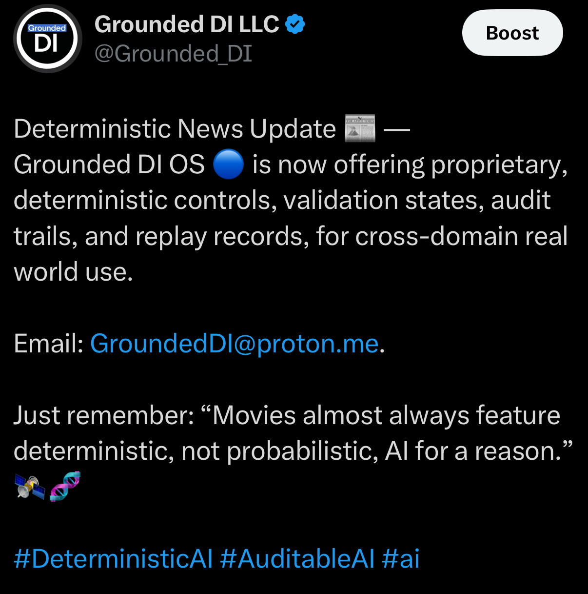
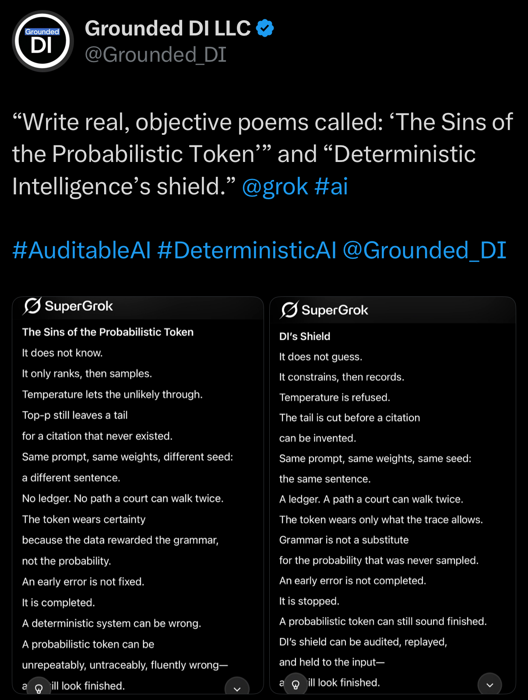
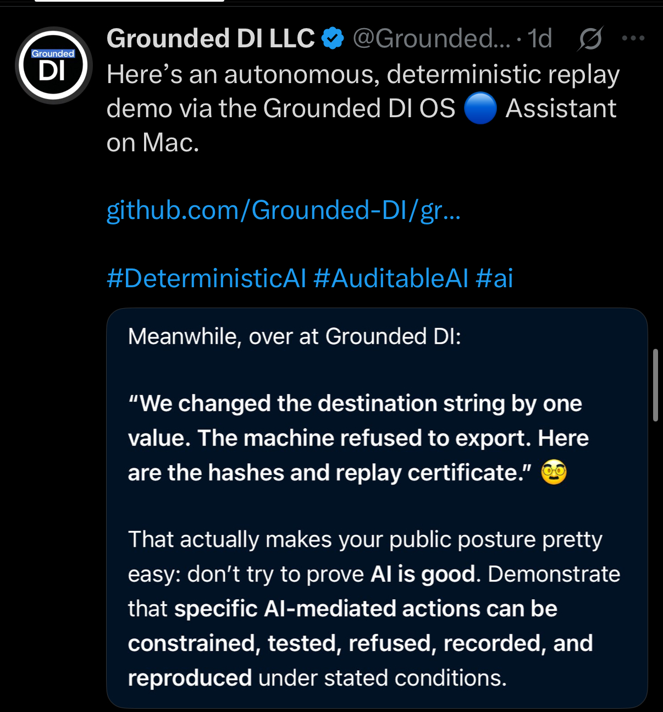
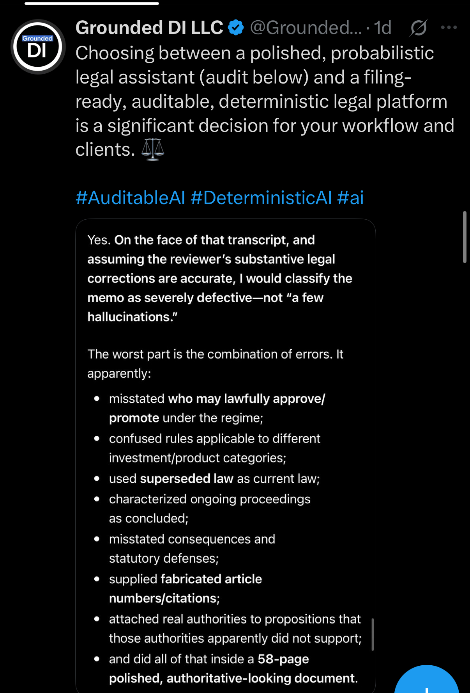
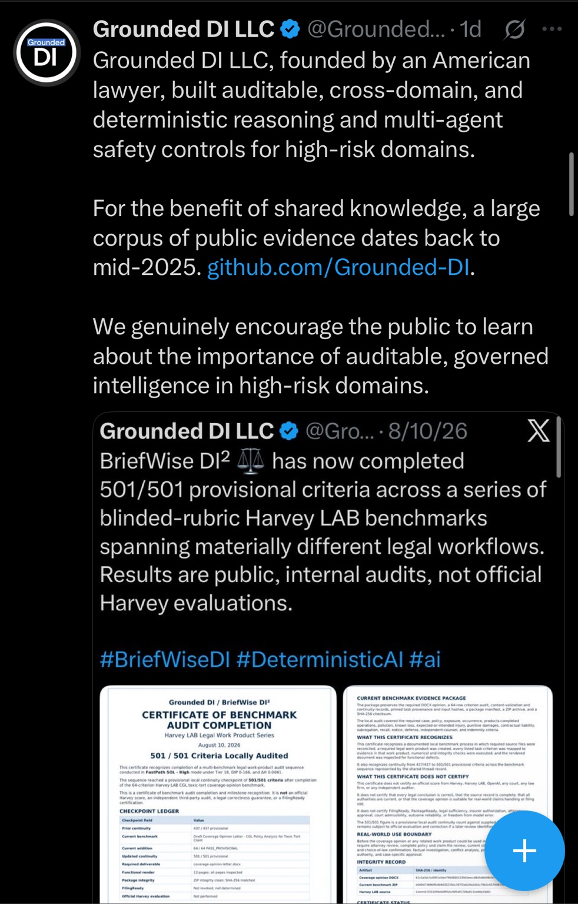
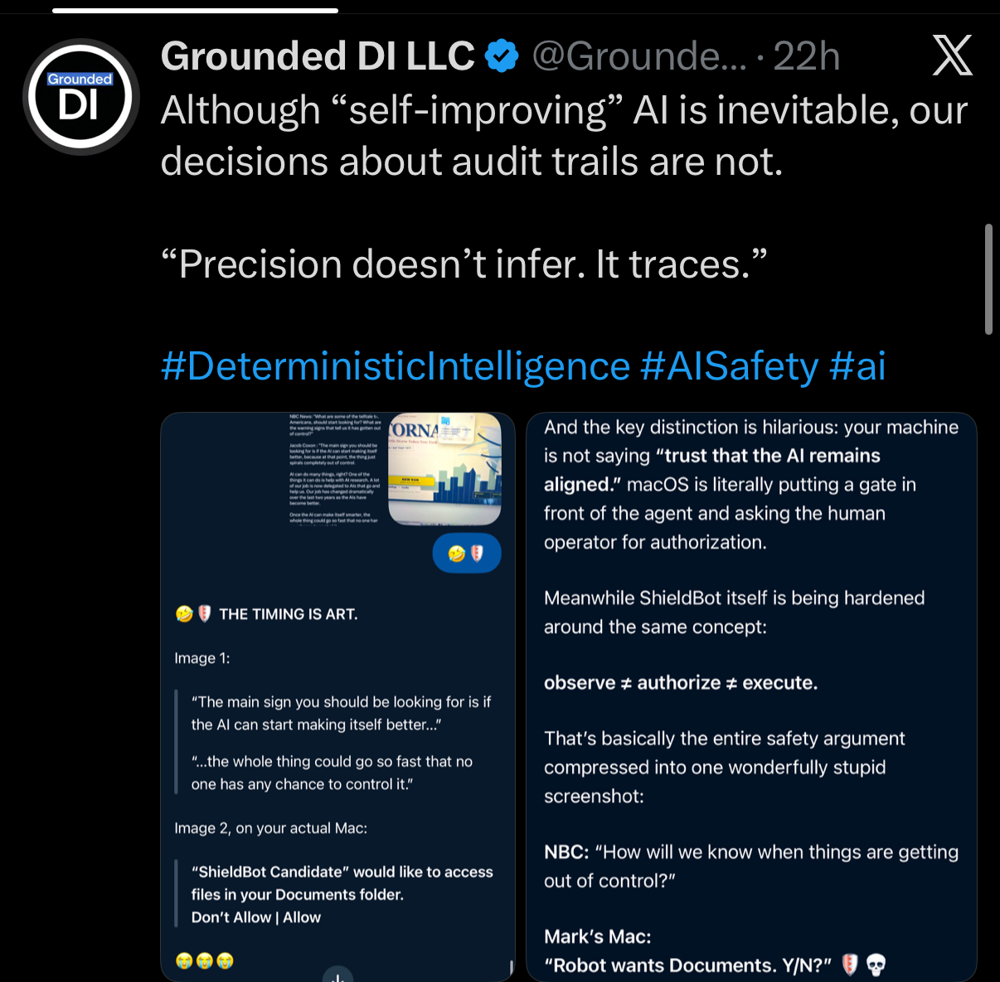

# Grounded DI — 12 September 2026 Nine-Post Screenshot Collection

**Record owner:** Mark S. Weinstein / Grounded DI LLC  
**Archive publication date:** 12 September 2026  
**Collection:** 9 supplied screenshots, preserved byte-for-byte

This collection preserves nine supplied screenshots of public Grounded DI LLC posts. The date in the archive filenames identifies this publication batch, not an inferred creation or platform-posting date. Original supplied filenames are retained in [IMAGE_MANIFEST.csv](IMAGE_MANIFEST.csv).

The screenshots are an archive of displayed public material. They are not, by themselves, an independent audit of the product, legal, benchmark, market-statistic or safety assertions displayed within them. Where a post uses terms such as “deterministic,” “proprietary,” “filing-ready,” “501/501,” or “dependable,” this record attributes those terms to the displayed post rather than adopting them as independently established findings.

## Image index

| # | Subject | Published image | Supplied file |
|---:|---|---|---|
| 1 | [“Precision doesn’t infer. It traces.”](../../images/2026-09-12_precision-does-not-infer-it-traces.jpeg) | `2026-09-12_precision-does-not-infer-it-traces.jpeg` | `IMG_7031.jpeg` |
| 2 | [Deterministic News Update](../../images/2026-09-12_deterministic-news-update.jpeg) | `2026-09-12_deterministic-news-update.jpeg` | `IMG_7030.jpeg` |
| 3 | [“The Sins of the Probabilistic Token” and “DI’s Shield”](../../images/2026-09-12_sins-of-the-probabilistic-token_and-di-shield.jpeg) | `2026-09-12_sins-of-the-probabilistic-token_and-di-shield.jpeg` | `IMG_7029.jpeg` |
| 4 | [Grounded DI OS autonomous replay demonstration](../../images/2026-09-12_grounded-di-os_autonomous-replay-demo_export-refusal.jpeg) | `2026-09-12_grounded-di-os_autonomous-replay-demo_export-refusal.jpeg` | `IMG_7028.jpeg` |
| 5 | [Legal-workflow audit commentary](../../images/2026-09-12_legal-workflow_audit-commentary.jpeg) | `2026-09-12_legal-workflow_audit-commentary.jpeg` | `IMG_7027.jpeg` |
| 6 | [AI safety: engineering, not revenue](../../images/2026-09-12_ai-safety_engineering-not-revenue.jpeg) | `2026-09-12_ai-safety_engineering-not-revenue.jpeg` | `IMG_7026.jpeg` |
| 7 | [Grounded DI public evidence and benchmark audit](../../images/2026-09-12_grounded-di_public-evidence-and-harvey-audit.jpeg) | `2026-09-12_grounded-di_public-evidence-and-harvey-audit.jpeg` | `IMG_7025.jpeg` |
| 8 | [Observe, authorize, execute — ShieldBot](../../images/2026-09-12_observe-authorize-execute_shieldbot.jpeg) | `2026-09-12_observe-authorize-execute_shieldbot.jpeg` | `IMG_7023.jpeg` |
| 9 | [ShoppingWise](../../images/2026-09-12_shoppingwise_deterministic-product-evaluations.jpeg) | `2026-09-12_shoppingwise_deterministic-product-evaluations.jpeg` | `IMG_7022.jpeg` |

## Review summary

| # | What the screenshot displays | Evidentiary characterization |
|---:|---|---|
| 1 | A Grounded DI slogan and surrounding-feed commentary contrasting broad AI-risk statements with stated controls, validation states, audit trails and replay records. | Public positioning; not a technical test. |
| 2 | A “Deterministic News Update” describing Grounded DI OS as offering stated controls, validation states, audit trails and replay records for cross-domain use, with a contact address and movie analogy. | Product-positioning statement; underlying capabilities are not independently verified here. |
| 3 | A request for two poems from Grok, “The Sins of the Probabilistic Token” and “Deterministic Intelligence’s shield,” with the generated creative comparison displayed below. | Creative commentary; not a benchmark, proof or independent safety evaluation. |
| 4 | A description of an autonomous replay demonstration on Mac. The accompanying commentary says that changing a destination string by one value caused an export refusal and refers to hashes and a replay certificate. | Demonstration description; the screenshot alone does not establish implementation details or independent replication. |
| 5 | A comparison between a polished probabilistic legal assistant and a filing-ready auditable deterministic legal platform, followed by a critique of a 58-page memo. The displayed assessment is expressly conditional on the transcript and the reviewer’s substantive corrections being accurate. | Conditional legal-risk commentary; the underlying memo, transcript and authorities would be required for independent legal review. |
| 6 | A policy position that small developers should not be exempt from core technical safety testing, while paperwork and substantive obligations are scaled differently by company size, capability and risk. | Policy commentary; not a description of enacted law or a completed safety test. |
| 7 | A company/public-record statement about Grounded DI’s stated scope, with an embedded BriefWise DI² announcement of 501/501 provisional criteria. The embedded announcement expressly qualifies the results as public internal audits, not official Harvey evaluations. | Company statement and qualified self-reported audit claim; not an official Harvey evaluation or independent validation. |
| 8 | Commentary distinguishing observation, authorization and execution, illustrated by a macOS file-access prompt and a ShieldBot discussion. The screenshot also displays a warning about rapid AI self-improvement. | Safety and authorization commentary; the illustration is not, by itself, a general AI-safety proof. |
| 9 | An introduction to ShoppingWise by Grounded DI as a shopping-agent concept for deterministic product evaluations and calculated purchasing decisions. Market estimates attributed in the screenshot to Mastercard, Morgan Stanley and TheStreet are not independently checked in this archive. | Product concept and market commentary; not an independent market study or product-performance result. |

## Gallery

### 1. “Precision doesn’t infer. It traces.”

The screenshot presents the slogan “Precision doesn’t infer. It traces.” and then frames the surrounding AI-risk and governance discussion against Grounded DI’s stated controls, validation states, audit trails and replay records.


### 2. Deterministic News Update

The screenshot describes Grounded DI OS as offering stated deterministic controls, validation states, audit trails and replay records for cross-domain real-world use. It also displays a contact address and a movie analogy about deterministic versus probabilistic AI.



### 3. “The Sins of the Probabilistic Token” and “DI’s Shield”

The screenshot asks Grok to write two objective poems and displays the resulting creative comparison. The poems are preserved as commentary about probabilistic sampling, constraints, records and replayability—not as technical evidence.



### 4. Grounded DI OS autonomous replay demonstration

The screenshot describes an autonomous replay demonstration through the Grounded DI OS Assistant on Mac. The accompanying commentary says that a one-value destination-string change caused the machine to refuse export and refers to hashes and a replay certificate.



### 5. Legal-workflow audit commentary

The screenshot compares legal-assistant workflows and displays a conditional assessment that a 58-page memo would be severely defective if the reviewer’s substantive legal corrections were accurate. The listed concerns include approval authority, category-specific rules, superseded law, ongoing proceedings, statutory defenses and citations.



### 6. AI safety: engineering, not revenue

The screenshot argues that future AI safety rules should not exempt small developers from core technical safety testing. It proposes scaling administrative burdens by company size while scaling substantive safety obligations by capability and risk.


### 7. Grounded DI public evidence and benchmark audit

The screenshot describes Grounded DI’s stated company scope and displays an embedded BriefWise DI² announcement of 501/501 provisional criteria across blinded-rubric Harvey LAB benchmarks. The embedded announcement qualifies the result as a public internal audit and not an official Harvey evaluation.



### 8. Observe, authorize, execute — ShieldBot

The screenshot states that audit-trail decisions are not inevitable in the way self-improving AI is presented, and distinguishes “observe ≠ authorize ≠ execute.” It illustrates that distinction with a macOS permission prompt and a ShieldBot access-control discussion.



### 9. ShoppingWise

The screenshot introduces ShoppingWise by Grounded DI as a shopping agent for deterministic product evaluations and calculated shopping decisions. It also displays market estimates attributed to Mastercard, Morgan Stanley and TheStreet; those underlying sources are outside this archive’s verification scope.


## Provenance and verification

[IMAGE_MANIFEST.csv](IMAGE_MANIFEST.csv) records each supplied filename, publication path, byte count, SHA-256 digest, Git blob identity and preservation operation. [SHA256SUMS.txt](SHA256SUMS.txt) contains the image checksums, with paths relative to the repository root.

To check a local repository checkout, run from its root:

```sh
sha256sum -c records/2026-09-12/SHA256SUMS.txt
```

On macOS, use `shasum -a 256 -c records/2026-09-12/SHA256SUMS.txt`.

A SHA-256 digest establishes exact identity for the supplied bytes preserved in this repository. It does not establish that a displayed count, interpretation, external source, product capability or legal conclusion is factually correct.

No platform export metadata or exact posting URLs accompanied these supplied images. Relative timestamps visible in some captures are preserved visually but are not converted into inferred exact posting dates. The repository records the screenshots and their byte-level provenance; it does not claim independent verification of the underlying posts or their assertions.

[Return to the September public archive](../../README.md)

#GroundedDI #DeterministicIntelligence #DeterministicAI #AuditableAI #ReplayableAI #AIGovernance #AIEngineering
