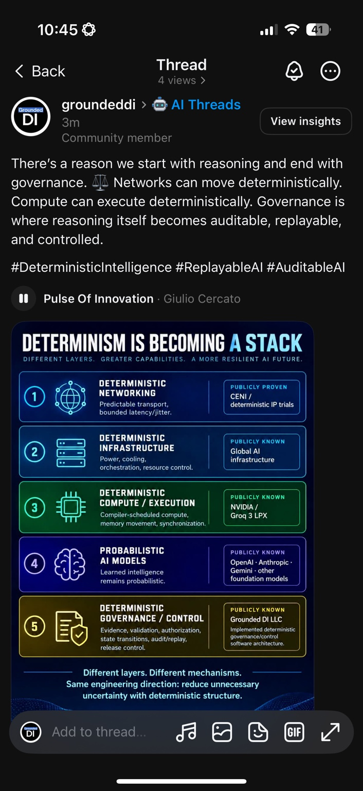
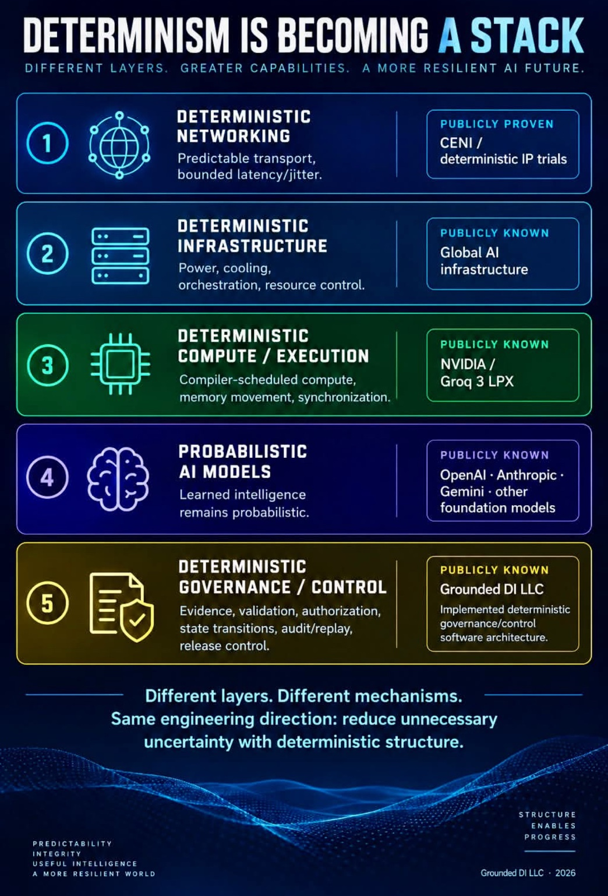
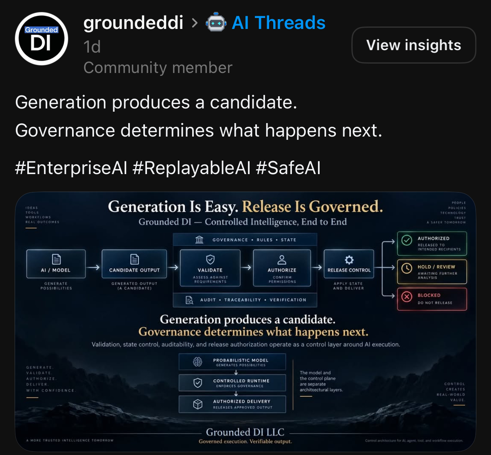
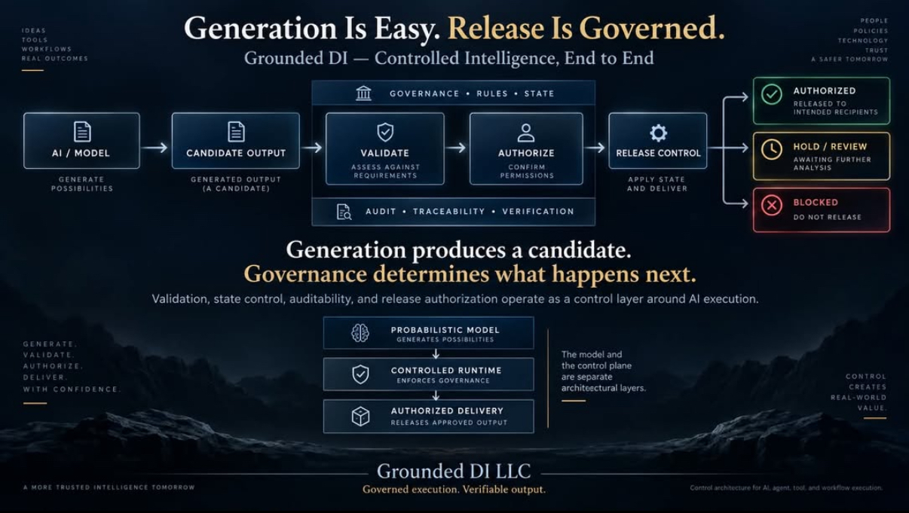
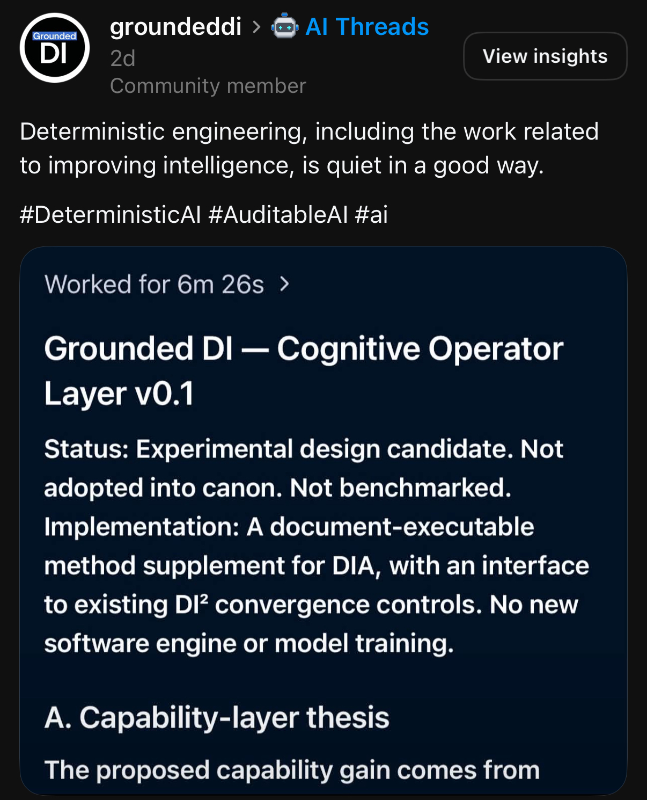
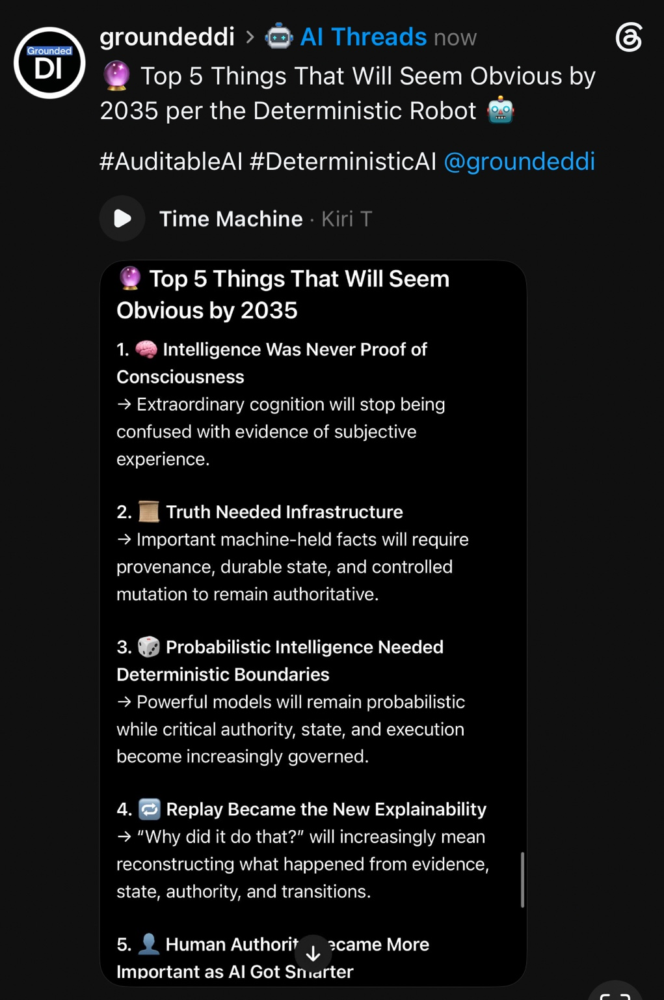

# Grounded DI — 16 September 2026 Six-Image Public Record

**Record owner:** Mark S. Weinstein / Grounded DI LLC
**Archive publication date:** 16 September 2026
**Collection:** 6 supplied JPEG captures, preserved byte-for-byte

This collection preserves six supplied images of public Grounded DI LLC posts and associated graphics. The date in the archive filenames identifies this publication batch, not an inferred creation or platform-posting date. Each supplied filename is retained in [IMAGE_MANIFEST.csv](IMAGE_MANIFEST.csv), and each capture has its own review record.

The six files represent four substantive content units plus two separately supplied detail captures: items 1 and 2 cover the “Determinism Is Becoming a Stack” material, items 3 and 4 cover the “Generation Is Easy. Release Is Governed.” material, and items 5 and 6 are separate Grounded DI posts. The files remain separate because the source supplied them separately.

The images are an archive of displayed public material. They are not, by themselves, an independent audit of the product, architecture, model, safety, governance or experimental-design assertions displayed within them. Where a post or graphic uses terms such as “deterministic,” “auditable,” “replayable,” “authorized,” or “controlled,” this record attributes those terms to the displayed material rather than adopting them as independently established findings.

## Image index

| # | Subject | Individual review | Published image | Supplied file |
|---:|---|---|---|---|
| 1 | Reasoning-to-governance post capture | [Review](01-determinism-is-becoming-a-stack-post/README.md) | [2026-09-16_determinism-is-becoming-a-stack_post.jpeg](../../images/2026-09-16_determinism-is-becoming-a-stack_post.jpeg) | `IMG_7482.jpeg` |
| 2 | Determinism Is Becoming a Stack detail capture | [Review](02-determinism-is-becoming-a-stack-graphic/README.md) | [2026-09-16_determinism-is-becoming-a-stack_graphic.jpeg](../../images/2026-09-16_determinism-is-becoming-a-stack_graphic.jpeg) | `IMG_7483.jpeg` |
| 3 | Governed-release post capture | [Review](03-generation-is-easy-release-is-governed-post/README.md) | [2026-09-16_generation-is-easy-release-is-governed_post.jpeg](../../images/2026-09-16_generation-is-easy-release-is-governed_post.jpeg) | `IMG_7484.jpeg` |
| 4 | Generation Is Easy. Release Is Governed. detail capture | [Review](04-generation-is-easy-release-is-governed-graphic/README.md) | [2026-09-16_generation-is-easy-release-is-governed_graphic.jpeg](../../images/2026-09-16_generation-is-easy-release-is-governed_graphic.jpeg) | `IMG_7485.jpeg` |
| 5 | Cognitive Operator Layer v0.1 post capture | [Review](05-cognitive-operator-layer-v0-1/README.md) | [2026-09-16_cognitive-operator-layer-v0-1_post.jpeg](../../images/2026-09-16_cognitive-operator-layer-v0-1_post.jpeg) | `IMG_7486.jpeg` |
| 6 | Deterministic Robot 2035 forecast post | [Review](06-deterministic-robot-top-5-by-2035/README.md) | [2026-09-16_deterministic-robot_top-5-things-obvious-by-2035.jpeg](../../images/2026-09-16_deterministic-robot_top-5-things-obvious-by-2035.jpeg) | `IMG_7508.jpeg` |

## Review summary

| # | What the capture displays | Evidentiary characterization |
|---:|---|---|
| 1 | A public AI Threads post stating that networks can move deterministically, compute can execute deterministically, and governance can make reasoning auditable, replayable and controlled. The embedded graphic presents five layers: deterministic networking, deterministic infrastructure, deterministic compute / execution, probabilistic AI models, and deterministic governance / control. | Public positioning and conceptual architecture graphic; not an independent technical test. |
| 2 | A full graphic-only capture of “DETERMINISM IS BECOMING A STACK,” including the five-layer presentation, example labels and the closing statement about reducing unnecessary uncertainty with deterministic structure. | Detail capture paired with item 1; not a separate substantive post or independent validation. |
| 3 | A public AI Threads post stating that generation produces a candidate and governance determines what happens next. The embedded graphic shows AI / model, candidate output, validate, authorize and release control, with authorized, hold / review and blocked outcomes. | Governance and release-control positioning; not an independent product, safety or authorization test. |
| 4 | A full graphic-only capture of “Generation Is Easy. Release Is Governed.” It repeats the candidate-to-release workflow and distinguishes a probabilistic model, controlled runtime and authorized delivery. | Detail capture paired with item 3; not a separate substantive post or independent validation. |
| 5 | A public AI Threads post about quiet deterministic engineering with a displayed “Grounded DI — Cognitive Operator Layer v0.1” card. The card labels itself an experimental design candidate, not adopted into canon and not benchmarked, and describes a document-executable method supplement. | Explicitly qualified experimental design record; not a benchmark, software release or independent capability demonstration. |
| 6 | A public AI Threads post titled “Top 5 Things That Will Seem Obvious by 2035 per the Deterministic Robot,” displaying five future-oriented propositions about consciousness, truth infrastructure, deterministic boundaries, replay-based explainability and human authority. | Structured future-oriented speculation; auditable as a source record but not a verified forecast, benchmark or empirical finding. |

## Gallery

### 1. Reasoning-to-governance post capture

The screenshot displays the caption “There’s a reason we start with reasoning and end with governance,” followed by statements about deterministic networking and compute and about auditable, replayable and controlled reasoning. The attached graphic is the “Determinism Is Becoming a Stack” presentation.



### 2. Determinism Is Becoming a Stack detail capture

This separately supplied graphic-only capture shows the full five-layer “Determinism Is Becoming a Stack” presentation. It appears to be the detail companion to item 1.



### 3. Governed-release post capture

The screenshot displays the caption “Generation produces a candidate. Governance determines what happens next,” with an attached “Generation Is Easy. Release Is Governed.” workflow graphic.



### 4. Generation Is Easy. Release Is Governed. detail capture

This separately supplied graphic-only capture shows the full candidate-to-release workflow and its authorized, hold / review and blocked outcomes. It appears to be the detail companion to item 3.



### 5. Cognitive Operator Layer v0.1 post capture

The screenshot displays a post about deterministic engineering and a work-output card labeled “Grounded DI — Cognitive Operator Layer v0.1.” The card expressly identifies the material as an experimental design candidate that is not adopted into canon and not benchmarked.



### 6. Deterministic Robot 2035 forecast post

The screenshot displays a structured list of five propositions framed as things that may seem obvious by 2035. It is preserved as deterministic speculation: the source wording and bytes are auditable, while the future claims remain speculative.



## Provenance and verification

[IMAGE_MANIFEST.csv](IMAGE_MANIFEST.csv) records each supplied filename, published path, byte count, SHA-256 digest, Git blob identity and preservation operation. [SHA256SUMS.txt](SHA256SUMS.txt) contains the image checksums, with paths relative to the repository root.

To check a local repository checkout, run from its root:

```sh
sha256sum -c records/2026-09-16/SHA256SUMS.txt
```

On macOS, use `shasum -a 256 -c records/2026-09-16/SHA256SUMS.txt`.

All six supplied JPEGs were copied byte-identically. Their input and published SHA-256 digests therefore match; the archive filenames are stable business-readable names. A SHA-256 digest establishes exact identity for the supplied bytes preserved in this repository. It does not establish that a displayed example, interpretation, product capability, workflow, safety statement, experimental-design proposition or future forecast is factually correct.

No platform export metadata or exact posting URLs accompanied the supplied images. Relative timestamps visible in some captures are preserved visually but are not converted into inferred exact posting dates. The repository records the screenshots and graphics and their byte-level provenance; it does not claim independent verification of the underlying posts or their assertions.

[Return to the September public archive](../../README.md)

#GroundedDI #DeterministicIntelligence #DeterministicAI #AuditableAI #ReplayableAI #AIGovernance #AIEngineering
