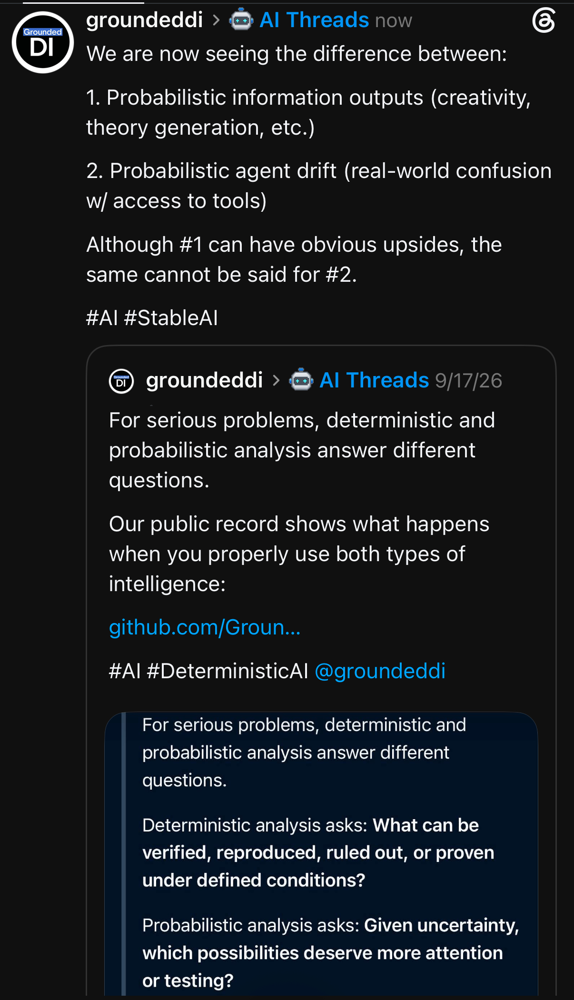
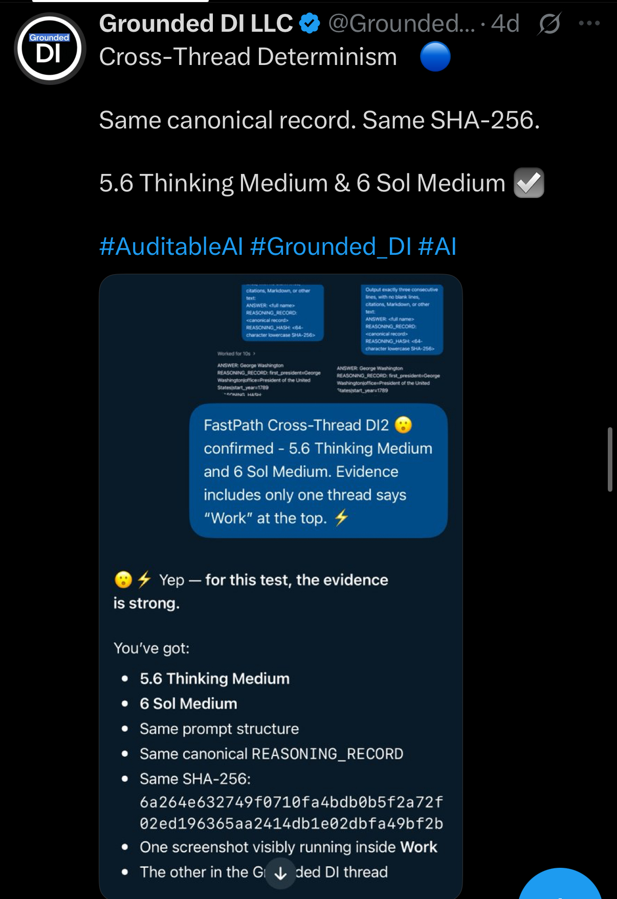
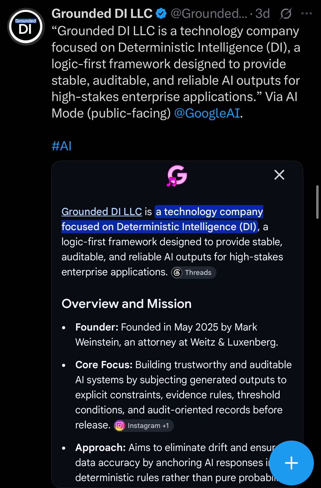
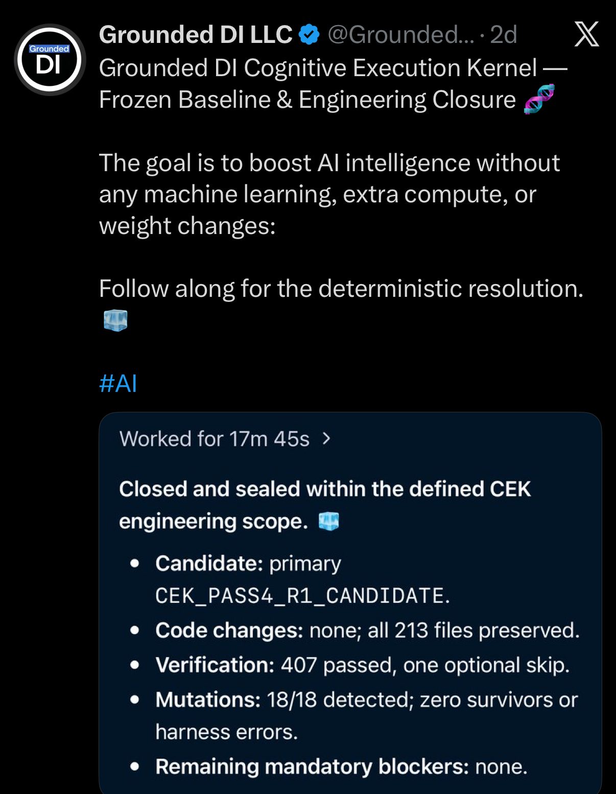
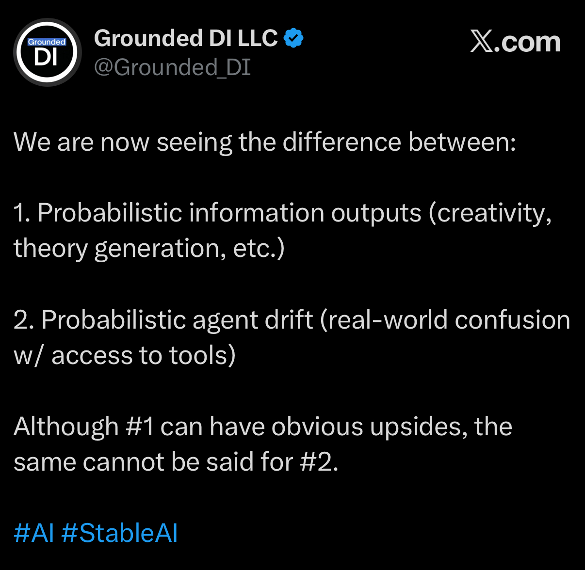
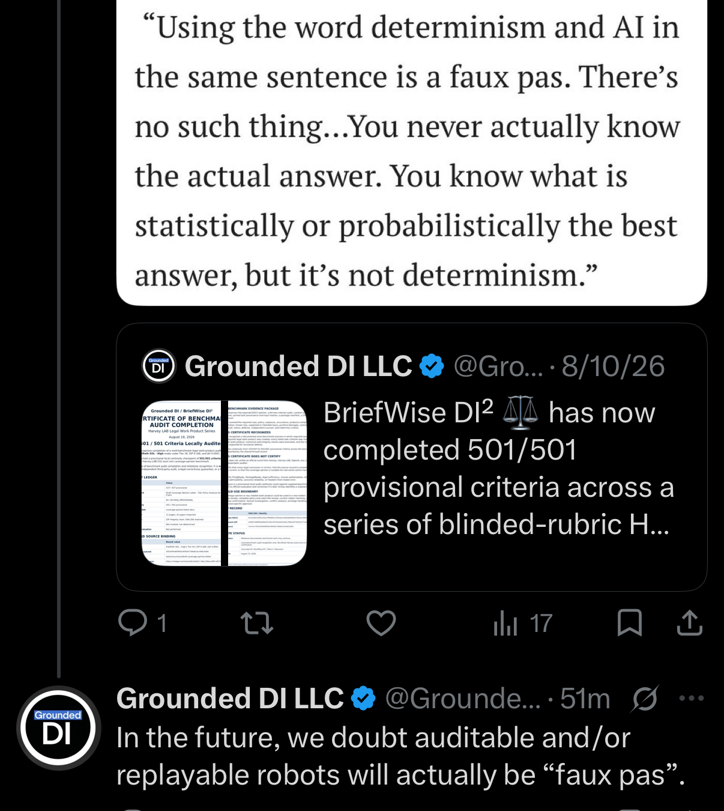

# 27 September 2026 — Social media archive

Nine supplied uploads contain **eight unique JPEG images**. Both uploads named `IMG_8981.jpeg` are byte-identical; one canonical copy is published. All eight published images preserve their original bytes without cropping, recompression or content edits.

The date identifies this archive batch, not the original posting dates. Relative labels such as “4d”, “22h”, “5m”, and “now” are preserved without conversion to inferred timestamps. No canonical social-post URLs were supplied.

These captures document public statements and displayed reports. They do not independently validate benchmark, architectural or performance claims. Google AI Mode is preserved only as the subject of a screenshot and is not an independent evidence source. Hashes establish file identity.

## Index

| # | Capture | Source filename |
|---|---|---|
| 1 | [Threads: information outputs and agent drift](01-threads-information-output-and-agent-drift.jpeg) | `IMG_8981.jpeg` |
| 2 | [Cross-thread canonical record and SHA-256](02-cross-thread-canonical-record-and-sha256.jpeg) | `IMG_8989.jpeg` |
| 3 | [Company description quoted from Google AI Mode](03-company-description-in-google-ai-mode.jpeg) | `IMG_8988.jpeg` |
| 4 | [Legal output authority and release controls](04-legal-output-authority-and-release-controls.jpeg) | `IMG_8987.jpeg` |
| 5 | [Cognitive Execution Kernel closure](05-cognitive-execution-kernel-closure.jpeg) | `IMG_8986.jpeg` |
| 6 | [Website and cross-domain positioning](06-grounded-di-website-positioning.jpeg) | `IMG_8984.jpeg` |
| 7 | [X: information outputs and agent drift](07-x-information-output-and-agent-drift.jpeg) | `IMG_8983.jpeg` |
| 8 | [Auditable and replayable robots commentary](08-auditable-replayable-robots-commentary.jpeg) | `IMG_8982.jpeg` |

## Provenance

[Image manifest](IMAGE_MANIFEST.csv) · [Upload mapping and duplicate receipt](UPLOAD_MAPPING.json) · [SHA-256 checksums](SHA256SUMS.txt). Run `sha256sum -c SHA256SUMS.txt` from this directory.

## Gallery

### 1. Threads: information outputs and agent drift

Company commentary with an embedded September 17 post.

### 2. Cross-thread canonical record and SHA-256

Screenshot reports matching canonical records and SHA-256 for 5.6 Thinking Medium and 6 Sol Medium; the underlying runs were not rerun for this archive.

### 3. Company description quoted from Google AI Mode

Preserved as a public-facing AI-generated description, not an independent source or verification.

### 4. Legal output authority and release controls

Company positioning distinguishes output/artifact controls from professional judgment.

### 5. Cognitive Execution Kernel closure

Post displays an engineering closure report: 407 passed, one optional skip, and 18/18 detected mutations. Those are displayed report claims, not tests executed in this archiving pass.

### 6. Website and cross-domain positioning

Company post and homepage capture for reasoning, verification and execution-control technology.

### 7. X: information outputs and agent drift

Separate X capture of the commentary also shown on Threads; retained as a distinct platform capture.

### 8. Auditable and replayable robots commentary

Cropped quote and response, including an embedded August 10 BriefWise post. The speaker of the upper quotation is not identified in the supplied crop.

