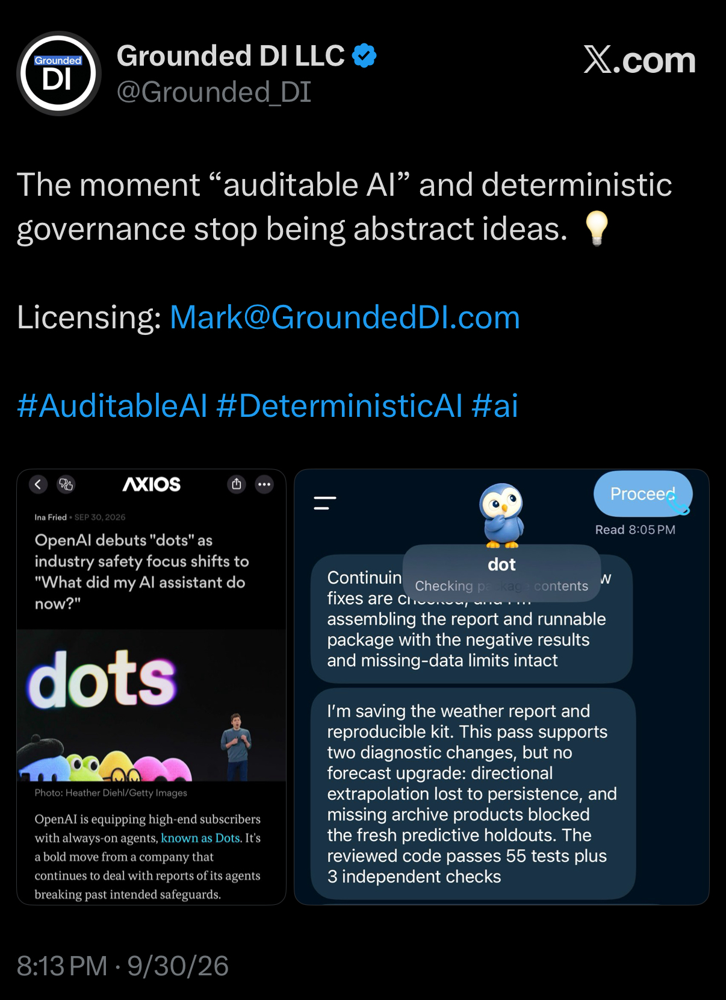
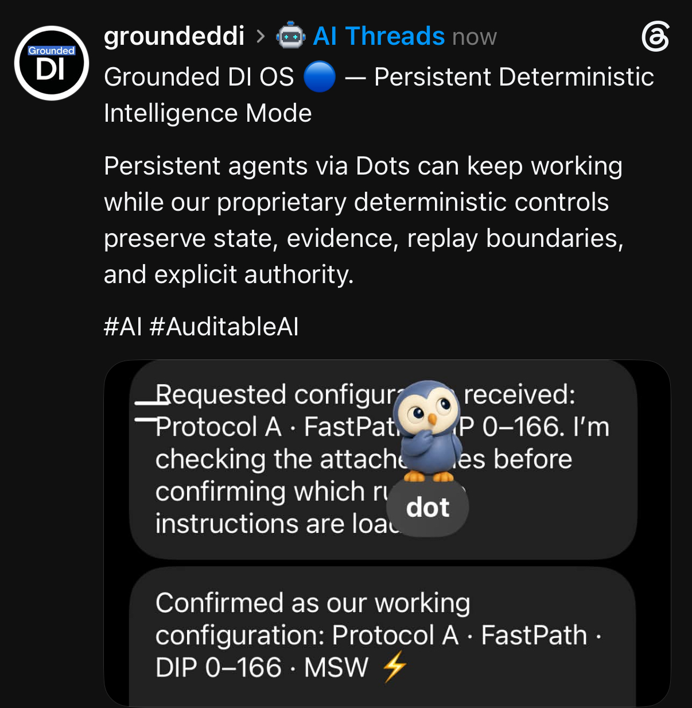
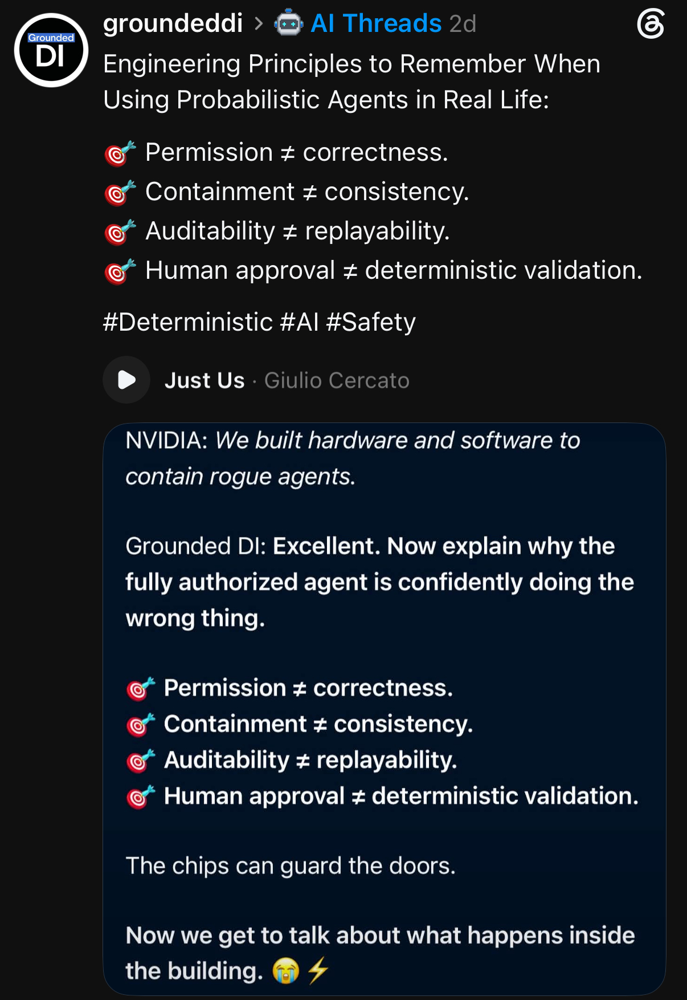
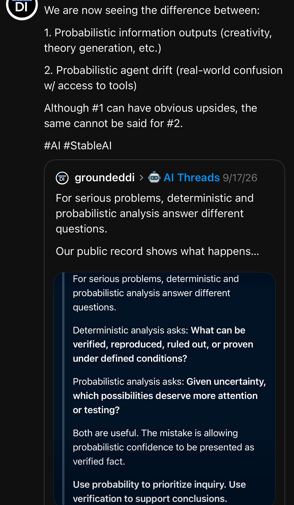
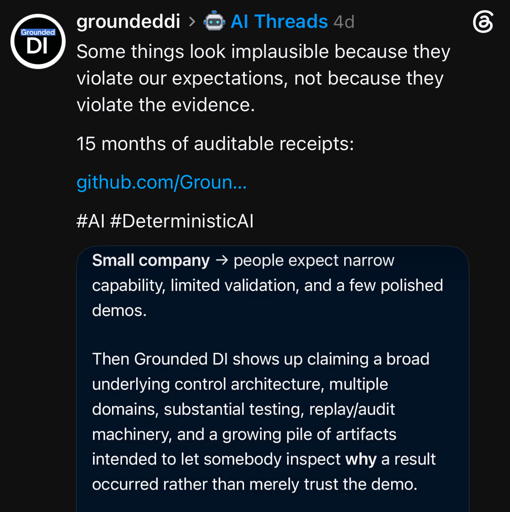
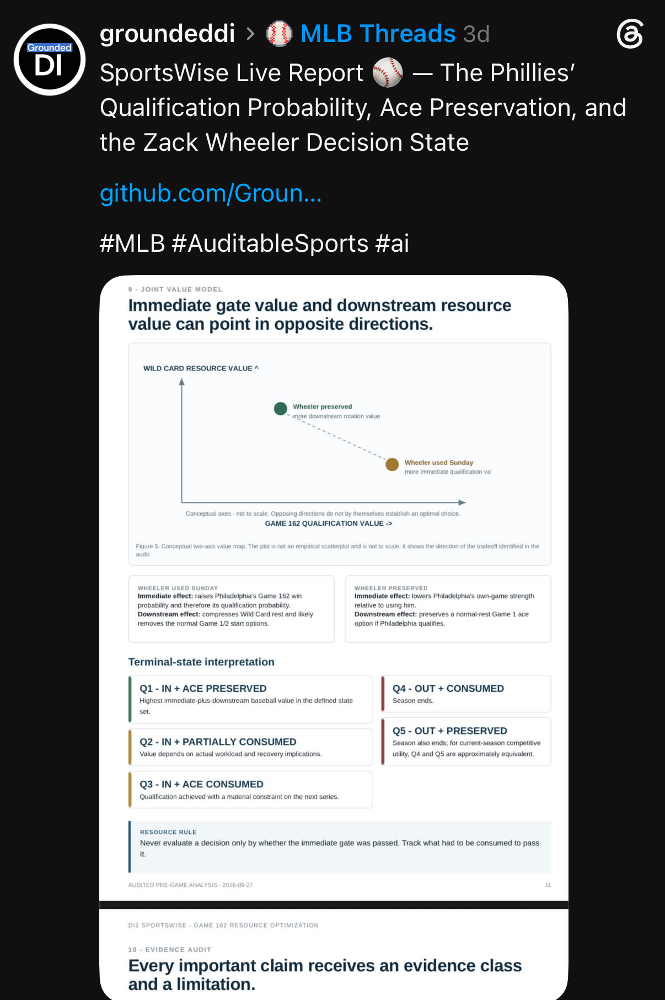
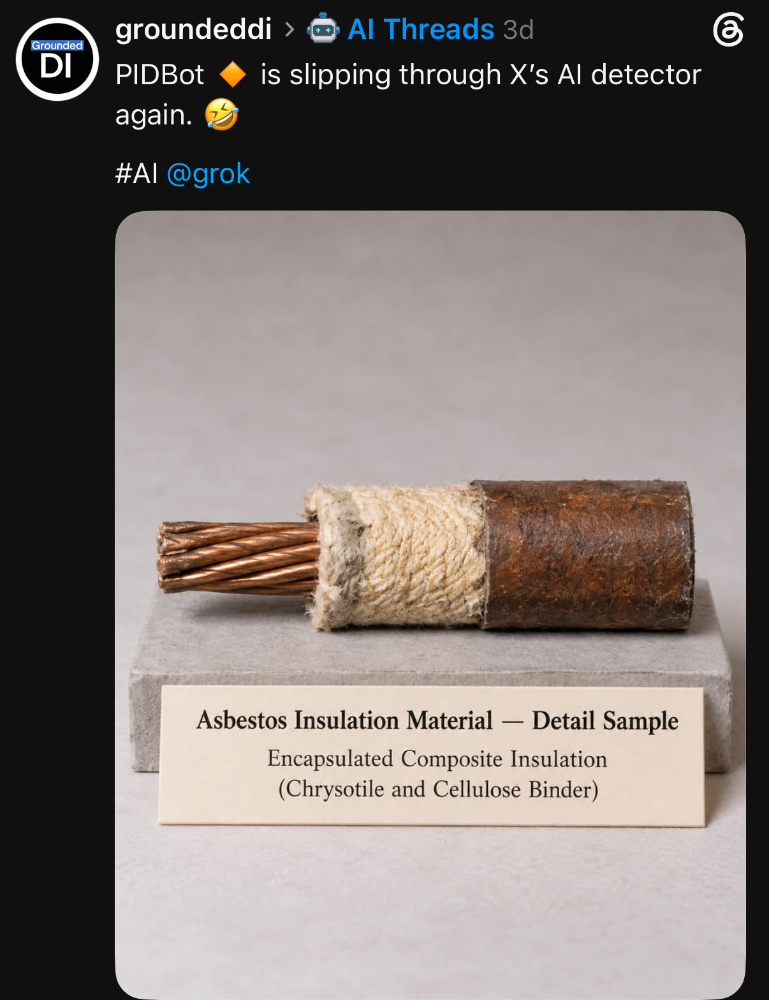

# 30 September 2026 — Auditable agents and public commentary

Seven supplied JPEG captures record Grounded DI's public commentary on persistent agents, execution controls, evidence and cross-domain decision analysis. All seven images retain their original bytes: no cropping, recompression or content edits.

**Record owner:** Mark S. Weinstein / Grounded DI LLC  
**Archive batch date:** 30 September 2026  
**Source platforms:** X and Threads  
**Record type:** screenshot archive and descriptive index

The archive date identifies this publication batch. Relative platform labels are preserved without conversion into inferred posting dates. The first image displays `8:13 PM · 9/30/26`; its timezone is not shown. No canonical social-post URLs were supplied, and shortened links are not expanded by guesswork.

These captures preserve displayed statements, illustrations and report excerpts. Underlying engineering, product, detector, news and sports claims were not independently verified in this archiving pass. Hashes identify the published files; they do not validate those claims. Persistent-agent configuration, implementation, measured behavior, replay and certification remain distinct evidence questions.

## Index

| # | Capture | Classification | Source filename |
|---:|---|---|---|
| 1 | [Auditable AI: Dots and a weather workflow](01-auditable-ai-dots-weather-workflow.jpeg) | Company commentary and displayed workflow report | `IMG_9485.jpeg` |
| 2 | [Grounded DI OS: persistent-agent working configuration](02-grounded-di-os-persistent-agent-working-configuration.jpeg) | Company positioning and displayed working configuration | `IMG_9408.jpeg` |
| 3 | [Agent engineering: permission, correctness and replay](03-agent-engineering-permission-correctness-and-replay.jpeg) | Engineering commentary | `IMG_9409.jpeg` |
| 4 | [Information outputs versus agent drift](04-information-outputs-versus-agent-drift.jpeg) | Conceptual and governance commentary | `IMG_9412.jpeg` |
| 5 | [Evidence, expectations and the auditable record](05-evidence-expectations-and-auditable-record.jpeg) | Company positioning | `IMG_9413.jpeg` |
| 6 | [SportsWise: Phillies qualification and Wheeler resource value](06-sportswise-phillies-qualification-and-wheeler-resource-value.jpeg) | Displayed sports decision-analysis excerpt | `IMG_9411.jpeg` |
| 7 | [PIDBot: product illustration and detector commentary](07-pidbot-product-illustration-and-detector-commentary.jpeg) | Illustrative image and detector commentary | `IMG_9410.jpeg` |

## Gallery and searchable excerpts

### 1. Auditable AI: Dots and a weather workflow

**Platform:** X · **Visible date label:** 8:13 PM · 9/30/26 (displayed; timezone not shown)

Grounded DI's X post places an Axios news capture beside a Dots weather-workflow conversation. The displayed assistant report preserves negative results: directional extrapolation lost to persistence, missing archive products blocked fresh predictive holdouts, and no forecast upgrade was supported. It reports 55 code tests plus 3 independent checks; those checks were not executed or independently reproduced for this archive.

> The moment “auditable AI” and deterministic governance stop being abstract ideas.



### 2. Grounded DI OS: persistent-agent working configuration

**Platform:** Threads · **Visible date label:** now (relative label)

The post describes persistent agents working under controls for state, evidence, replay boundaries and explicit authority. The embedded conversation checks supplied files before confirming Protocol A, FastPath, DIP 0–166 and MSW as its working configuration. This records the displayed configuration and company positioning; it does not establish a deployed enforcement mechanism or autonomous activity beyond the visible exchange.

> Persistent agents via Dots can keep working while our proprietary deterministic controls preserve state, evidence, replay boundaries, and explicit authority.



### 3. Agent engineering: permission, correctness and replay

**Platform:** Threads · **Visible date label:** 2d (relative label)

The post separates four properties that need their own evidence. The embedded NVIDIA comparison is company commentary; it is not archived as a verified NVIDIA quotation or an evaluation of NVIDIA's implementation.

> Permission ≠ correctness.
> Containment ≠ consistency.
> Auditability ≠ replayability.
> Human approval ≠ deterministic validation.



### 4. Information outputs versus agent drift

**Platform:** Threads · **Visible date label:** Top-level date not visible; embedded post displays 9/17/26

The capture distinguishes probabilistic information generation from agent drift with tool access. An embedded September 17 post explains the different questions answered by deterministic and probabilistic analysis. This subject also appears in the September 27 archive; this supplied capture is retained as a separate image, not another experiment.

> Use probability to prioritize inquiry. Use verification to support conclusions.



### 5. Evidence, expectations and the auditable record

**Platform:** Threads · **Visible date label:** 4d (relative label)

The post discusses how expectations about a small company can affect reception of its claimed control architecture and public artifacts. Its reference to 15 months of auditable receipts is preserved as the company's statement, not a newly calculated duration or an independent audit.

> Some things look implausible because they violate our expectations, not because they violate the evidence.



### 6. SportsWise: Phillies qualification and Wheeler resource value

**Platform:** Threads · **Visible date label:** 3d (relative label); embedded report displays 2026-09-27

The post displays a SportsWise report excerpt on the Phillies' qualification probability, ace preservation and the Zack Wheeler decision state. The visible figure labels its axes conceptual and not to scale. It compares immediate qualification value with downstream rotation value and lists terminal states; it does not, by itself, establish an optimal choice or a validated probability estimate.

> Never evaluate a decision only by whether the immediate gate was passed. Track what had to be consumed to pass it.



### 7. PIDBot: product illustration and detector commentary

**Platform:** Threads · **Visible date label:** 3d (relative label)

The post jokes about PIDBot passing X's AI detector and displays an insulation-sample illustration. The image label names chrysotile and cellulose binder. That label is part of the displayed illustration: it does not authenticate a physical sample, establish asbestos content, identify a manufacturer or prove any person's exposure. No detector output or reproducible detector test is included.

> PIDBot is slipping through X's AI detector again. (Post commentary.)



## Provenance and related records

[Image manifest](IMAGE_MANIFEST.csv) maps original filenames to archive paths, byte counts, dimensions, visible date labels, content classifications and SHA-256 digests. [SHA-256 checksums](SHA256SUMS.txt) cover the seven images, this README and the manifest. From this directory, run:

```bash
sha256sum -c SHA256SUMS.txt
```

All seven supplied captures are unique by SHA-256. The information-output/agent-drift theme overlaps the [27 September collection](../2026-09-27/README.md); retaining another capture does not add a new experiment or independent verification. See the [September archive index](../../README.md) and the [replay certificate registry](https://github.com/Grounded-DI/grounded-di-replay-certificate-registry) for separately identified evidence artifacts.

**Public topics:** Grounded DI, Protocol A, deterministic intelligence, auditable AI, agent governance, Dots, replay boundaries, SportsWise, PIDBot.
